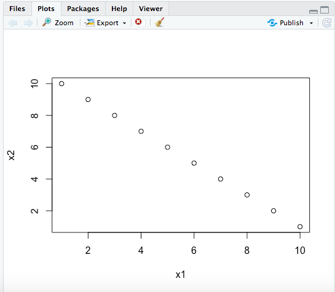

# rstudio_practice
To create this plot, I created a new file in RSudio to create an rscript. Once I did that, I could start typing the codes I wanted to plot. I then typed "plot(x1)" and saw my plot graph. 

## RStudio Graph 

