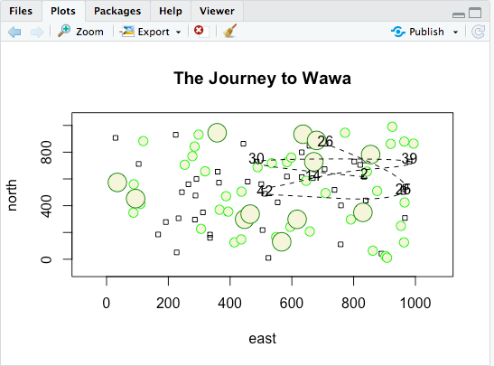

# Challenge Question

To complete the challege question, I copied the codes that I previously used for the more simple plo/question and just changed some of the values. For instance, the challenge question asked to change the x and y range to 1:1000 and randomly place 50 dwellings, 40 small circles (trees), and 12 large trees. After copying those same codes and changing the values, I then used the locs <- sample() function to get my seven random points and xspline to get my curved line. 

