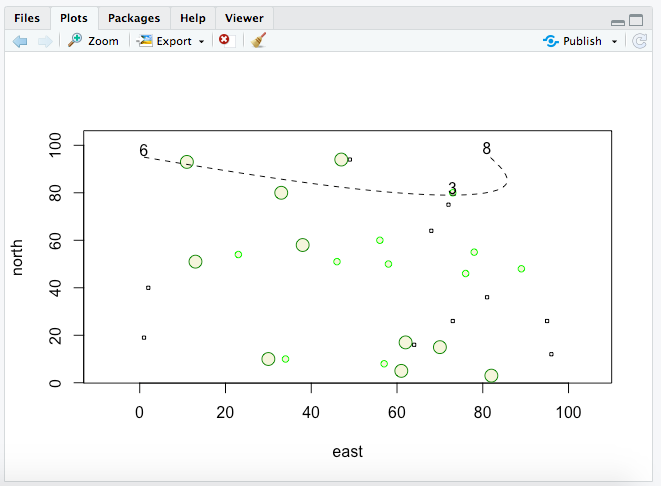

First, I set a new range for x and y (1:100). Then I set up the north and east axis to conduct a random sample for my plot. I created three symbols (two types of circles and a square) and gave each of them individual characteristics to differentiate them. This included size and color (fg, bg). Then I used xspline() to create my curved line, and finally added text() to get 3 points on that line. 

